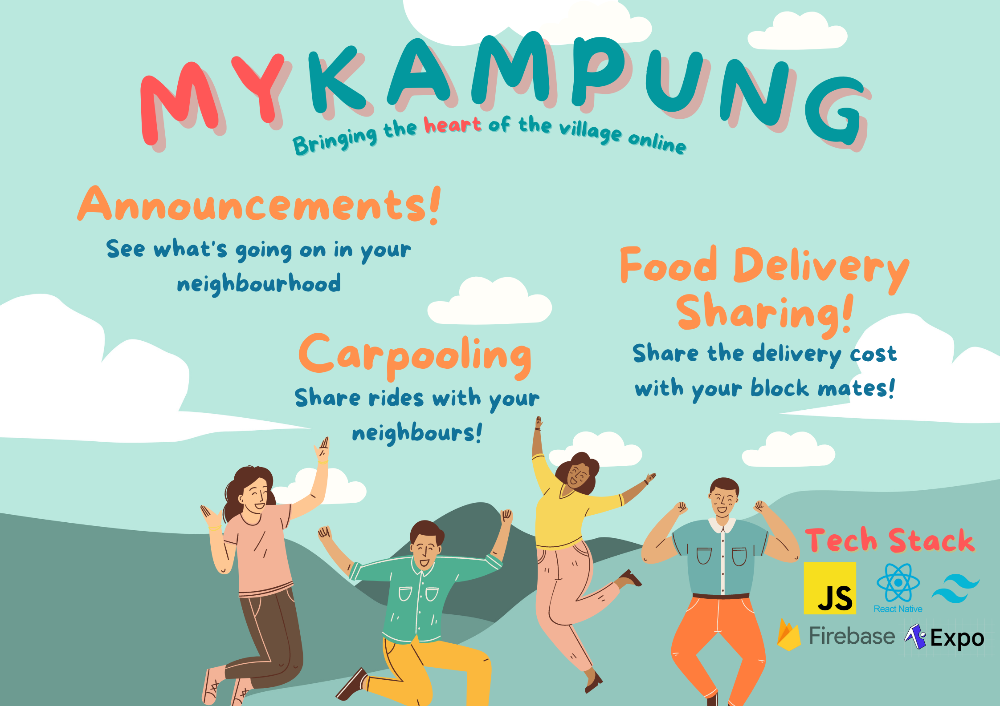
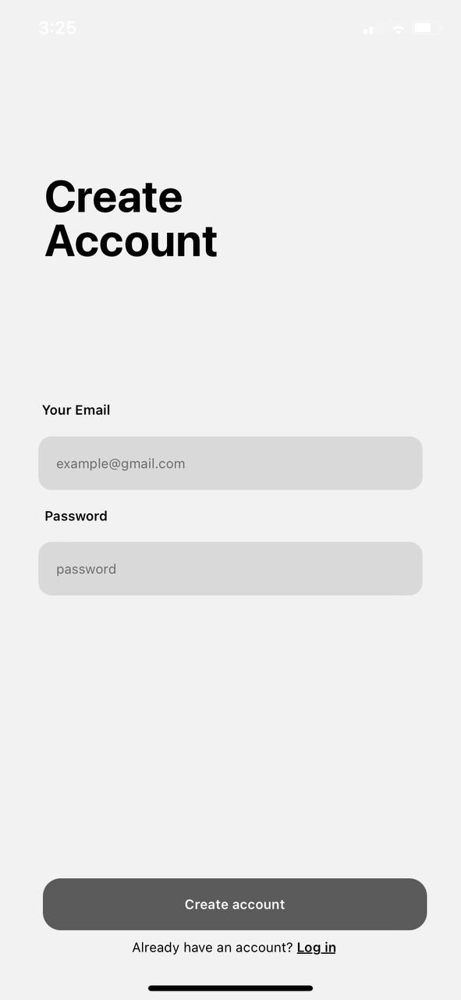
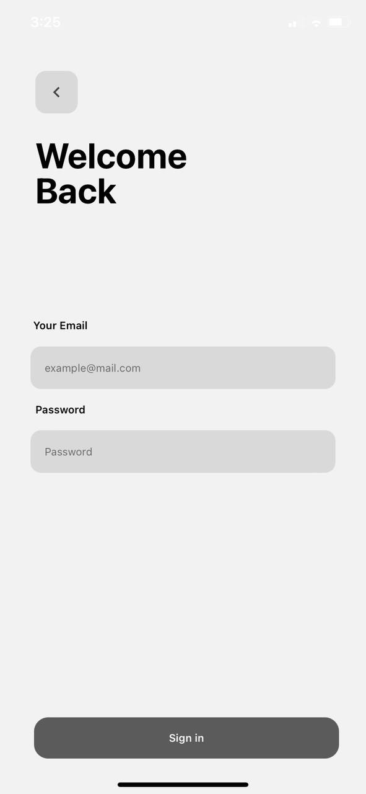
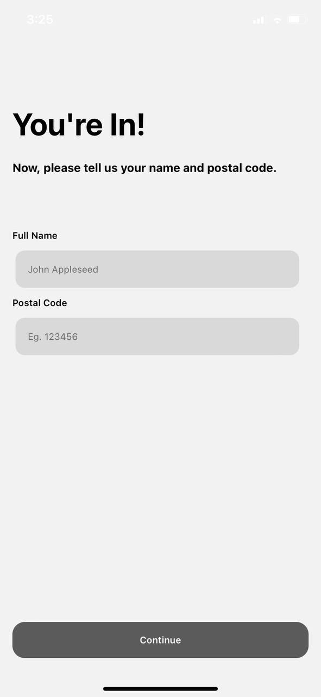
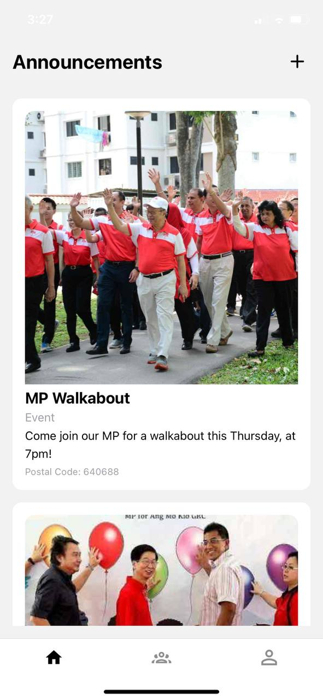
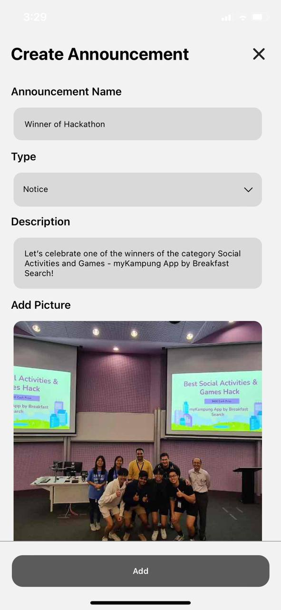
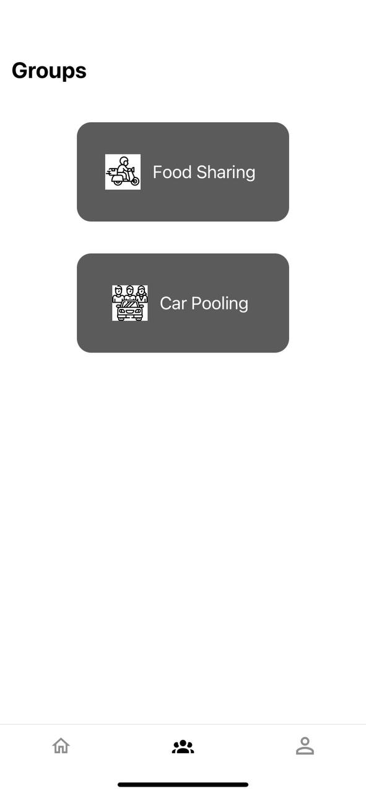
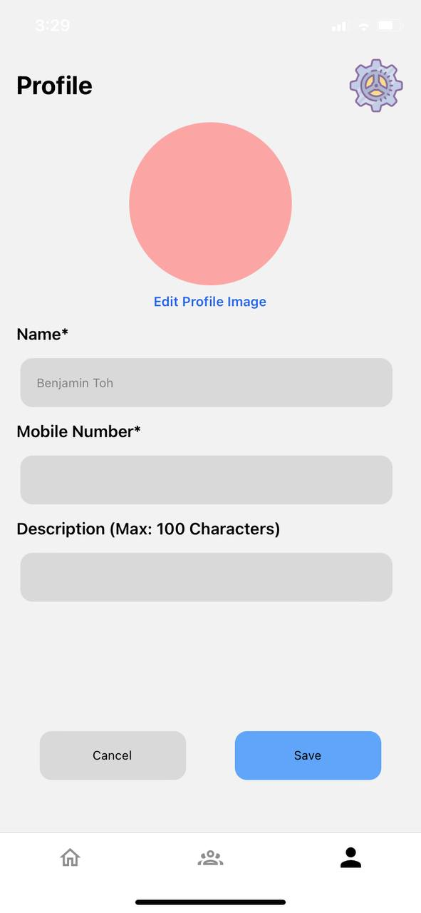
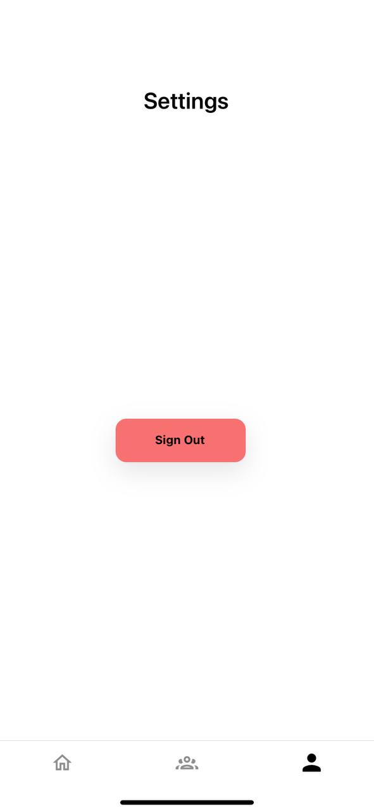

<div align="center">
    

# myKampung App with React Native
<p>
    Bringing the heart of the village online</br>
    <a href="https://www.sutdwth.com/">SUTD What the Hack 2022 Hackathon </a> Submission - Social  Activities & Games
</p>

</div>

<!-- Table of Contents -->
## Table of Contents

- [About](#about)
    - [Motivation](#motivation-for-the-project)
    - [Scope](#scope)
    - [Tech Stack](#tech-stack)
    - [Features](#features-of-the-app)
- [Getting Started](#getting-started)
  - [Prerequisites](#prerequisites)
  - [Installation](#installation)
  - [Run Locally](#running-it)
- [Future Developments](#future-developments)
- [The Team](#the-team)

<!-- About the Project -->
## About

<!-- Motivation -->
### Motivation for the Project
<p>
With the advancement of technology, people are becoming increasinly isolated and stuck in their own world of devices. This is where we introduce the same technology to bring them back together!
</p>
<p>
With this app, we can bring back the Kampung Spirit of togetherness as some things are done best with the people around you.
</p>

<!-- Project Scope -->
### Scope
<p>
    React Native App - 
    <strong>Navigation Structure, Authentication Flow, Screens</strong>
</p>
<p>
    Database Backend - 
    <strong>Firebase Integration, Email Authentication, User Details, Announcement Storage, Profiles</strong>
</p>
<p>
    Groups - 
    <strong>Chat Groups, Link Provider</strong>
</p>

<!-- Tech Stack -->
### Tech Stack
<details>
    <summary>Client</summary>
    <ul>
        <li>
            <a href="https://www.javascript.com/">Javascript</a>
            
        </li>
        <li>
            <a href="https://reactnative.dev/docs/getting-started">
            React Native
            </a>
            
        </li>
        <li>
            <a href="https://docs.expo.dev/introduction/expo/">Expo</a>
            
        </li>
        <li>
            <a href="https://tailwindcss.com/">TailwindCSS / NativeWind</a>
            
        </li>
    </ul>
</details>
<details>
    <summary>Database</summary>
    <ul>
        <li>
            <a href="https://firebase.google.com/">Firebase Google Cloud</a>
            
        </li>
    </ul>
</details>

<!-- Features with screenshots -->
### Features of the App
<h4>Email Authentication</h4>
<ol>
    <strong>Registration - Firebase email auth</strong>
    </br>
    </br>
    
</ol>
<ol>
    <strong>Log in - Returning user</strong>
    </br>
    </br>
    
</ol>

<h4>Configure Profile</h4>
<ol>
    <strong>
        Configures and groups users according to postal code/ HDB Block
    </strong>
    <p>Only if user has not already configured their profile</p>
    
</ol>

<h4>Announcement Screen</h4>
    <ol>
        <strong>
            Announcments for the whole block to see for ease of access to info with most recent annocunement at the top
        </strong>
        <p>Allows community leaders to easily spread info</p>
        
    </ol>

<h4>Create Announcement Modal</h4>
    <ol>
        <strong>
            Add new announcments to the board
        </strong>
        <p>Detailing the announcment name, type (notice/event/warning), a short description and an image</p>
        
    </ol>
<h4>Carpool & Food Delivery Groups</h4>
    <ol>
        <strong>
            Chat groups for carpooling & ordering food together - saves money
        </strong>
        </br>
        </br>
        
    </ol>

<h4>Profile Screen and Sign Out</h4>
    <ol>
        <strong>Make edits to profile</strong>
        </br>
        </br>
        
    </ol>
    <ol>
        <strong>Settings - sign out button</strong>
        </br>
        </br>
        
    </ol>
</br>

<!-- Getting Started -->
## Getting Started

<!-- Prereqs (what you need to install) -->
### Prerequisites
<ul>
    <li>Yarn</li>
    <li>Expo account</li>
    <li>NativeWind (TailwindCSS)</li>
    <li>Firebase</li>
</ul>

<!-- Installation of project -->
### Installation
<p>Install yarn package manager and Node.js</p>
<p>Install Expo CLI</p>
<p>Mobile client app Expo Go to open the project on Android/IOS or any web browser will do</p>

<!-- Running the project -->
### Running it

Clone the project
```bash
  git https://github.com/bentohset/sutdwth-mykampung.git
  cd sutdwth-mykampung
```

Install dependencies
```bash
  yarn
```

Run the server
```bash
  yarn start
```


<!-- Future considerations -->
## Future Developments
<ol>
    <strong>Authentication</strong>
    <p>Implement Singpass authentication to automatically call user's location/ postal code</p>
</ol>
<ol>
    <strong>Location</strong>
    <p>Add option to choose between block or region (introduces condos and landed properties)</p>
</ol>
<ol>
    <strong>Announcement Tabs</strong>
    <p>Tabs to filter based on announcement types</p>
</ol>
<ol>
    <strong>Groups</strong>
    <p>Built-in chat groups and feature to split costs and pay through the app</p>
</ol>
<ol>
    <strong>Profile and Settings</strong>
    <p>To add more parameters</p>
</ol>
<ol>
    <strong>Styling</strong>
    <p>Clean up the app and introduce an appealing color scheme</p>
</ol>

<!-- The team -->
## The Team
<p>Introducting Breakfast Search - the winners of the 2022 SUTD Hackathon Social and Games category</p>
<ol>
    <strong>Ansenn Lee</strong>
</ol>
<ol>
    <strong>Benjamin Toh</strong>
</ol>
<ol>
    <strong>Sriram</strong>
</ol>
<ol>
    <strong>Tay Jiun Yuan</strong>
</ol>